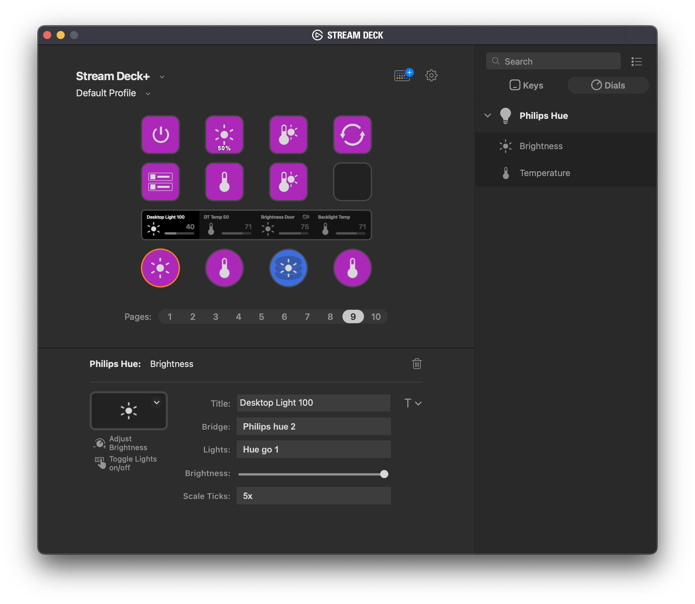

# Philips Hue Plugin for Elgato Stream Deck
This sample plugin allows controlling `Philips Hue` lights in your network. It's a demonstration of the [Stream Deck SDK](https://developer.elgato.com/documentation/stream-deck/).
Since version 1.6.0, it also supports the Stream Deck +. The brightness-action contains an example of how to change the display of the dial-control's touch-panel.

## Version 1.6.3 is also available in the Stream Deck Store!

# Features
- Code written in JavaScript
- Cross-platform (macOS, Windows)
- Localized
- Basic support for Stream Deck +

# Installation
In the [Release](./Release) folder, you can find the file `com.elgato.philips-hue.streamDeckPlugin`. If you double-click this file on your machine, Stream Deck will install the plugin.

# Source code
The [Sources](./Sources) folder contains the source code of the plugin.

# Changes
## 1.6.4
- fixed/improved support for temperature actions
- PI now lets you only select lights for a temperature action if they support color temperature

## 1.6.3
- updated CSS to the latest versions of our SDK-libs
- added an option to the PI to allow larger steps if you rotate dials (1,2,3,4,5,10).

## 1.6.0
- fixed broken localizations
- changed versioning to semver
- added basic support for Stream Deck +

# How it works (since 1.6.0)

 You can now drag a brightness-/ or temperature-action to a SD+ dial-control. It supports these actions:
 - Turn the dial to change the brightness/temperature
 - Press the dial to:
 - - set the brightness/temperature to the configured value - if the light is on
 - - turn the light on - if the light is off
 - Long-Press the dial to toggle the light on/off
 - Tap the touch-panel to toggle the light on/off
  
 DialStacks are not properly supported yet.

